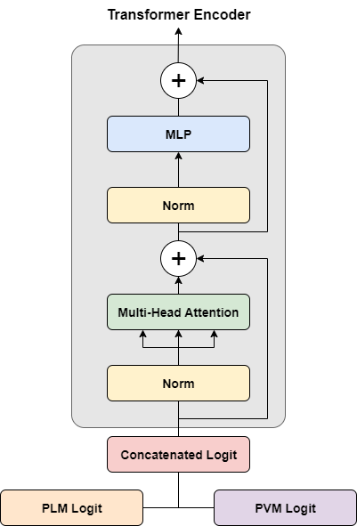

## Vietnamese Multimodal Sarcasm Detection

### Introduction

This is an implemented model as part of the UIT Data Science Challenge 2024 Board B, whose goal is to detect different types of sarcasm given an input text and image.

The model in this project utilizes the transformer architecture with the follow pipeline:
<ol>
    <li>The logit of text and image is obtained separately through the corresponding pre-trained models</li>
    <li>Both logit are then concatenated and used as input for the transformer encoder</li>
    <li>The logit of the [CLS] is used for the final classification</li>
</ol>



### Requirements
The code was written and tested at the time using these packages/libraries:
- python==3.10.4
- tqdm==4.62.3
- numpy==1.25.2
- pandas==1.5.2
- matplotlib==3.7.1
- scikit-learn==1.2.0
- transformers==4.47.1
- timm==1.0.19

### Data
The data used for this task is VIMMSD-UIT2024, which is a collection of social media posts with images and captions, including 2 folders: *images* and *annotations*:
<ul>
    <li>*images*: contain the images (.jpg)</li>
    <li>*annotations*: contains the .json file with the following details</li>
    <ul>
        <li>*image*: name of the image file</li>
        <li>*caption*: caption of the image</li>
        <li>*label*: label for sarcasm detection</li>
    </ul>
    <li>The data is available on <a href="https://www.kaggle.com/datasets/tienanh2003/vimmsd-uit2024">Kaggle</a></li>
    <li>There are 4 labels: *multi-sarcasm*, *not-sarcasm*, *image-sarcasm*, and *text-sarcasm*.</li>
</ul>

The structure of the data folder should be the following:

```
Vietnamese Multimodal Sarcasm Detection
│   ...
└───data
    └───annotations
    |   train.json
    |   dev.json
    └───images
        |
        └───train
        |   ...
        └───dev
        |   ...
```
After downloading the data, the files' names in **annotations** must be changed to *train.json* and *dev.json*, and the folders' names in **images** must be changed to *train* and *dev*

Sample data can be viewed in the [data folder](data)

### Custom arguments
All of the user input arguments:
```
--EPOCHS: type=int, default=5, help='Number of training epochs'
--PLM: type=str, default='vinai/phobert-base-v2', help='HuggingFace pre-trained language model (https://huggingface.co/models)'
--PLM_OUTPUT_SIZE: type=int, default=768, help='The output size of HuggingFace pre-trained language model (usually 768 for any base models)'
--PLM_MAX_TOKEN: type=int, default=200, help='Max number of tokens when tokenized by the pre-trained tokenizer'
--WORD_SEG: type=bool, default=True, help='Apply word segmentation to the images\' captions; this only works with Vietnamese (should be set to True only when working with language models requiring word segmentation, e.g., PhoBert).'
--SEG_PLM: type=str, default='NlpHUST/vi-word-segmentation', help='HuggingFace pre-trained language model used for word segmentation'
--PVM: type=str, default='timm/vit_base_patch16_224.augreg2_in21k_ft_in1k', help='timm pre-trained vision model (https://huggingface.co/timm/models)'
--PVM_OUTPUT_SIZE: type=int, default=768, help='The output size of timm pre-trained vision model (e.g, 768 for ViT, 2048 for Resnet)'
--PLM_LR: type=float, default=1e-5, help='Learning rate for pre-trained language model'
--PVM_LR: type=float, default=1e-5, help='Learning rate for pre-trained vision model'
--ENCODER_LR: type=float, default=1e-4, help='Learning rate for the encoder block'
--OPTIMIZER: type=str, default='AdamW', help='Pytorch optimizer (check torch.optim for the full list)'
--TRAIN_BATCH: type=int, default=32, help='Number of instances in a batch during training'
--DEV_BATCH: type=int, default=16, help='Number of instances in a batch during testing'
--PRINT_BATCH: type=int, default=50, help='Print loss after a number of batches'
--RANDOM_SEED: type=int, default=2024, help='Random seed'
--DATA_PATH: type=str, default='data', help='Path to data directory'
--USE_DUMMY: type=bool, default=False, help='Whether to create and use a dummy dataset by splitting the input train dataset into smaller datasets with numbers of labels proportional to the original one'
--DUMMY_PATH: type=str, default='dummy_data', help='Create path to dummy data directory'
--DUMMY_DATASET: type=str, default='train', help='The original dataset that will be used to make dummy data'
--DUMMY_SAMPLES: type=int, default=5000, help='Number of samples in the dummy dataset (must be equal or smaller than the original dataset)'
--DUMMY_DEV_SIZE: type=float, default=0.2, help='The proportion of the dummy dataset to include in the dev split (between 0.0 and 1.0)'
--GET_METRICS: type=bool, default=False, help='Perform evaluation on the devset and show the metrics - sklearn classification report(Set to True only when the devset has labels or else the result will be wrong)'
--PLOT_CONFMAT: type=bool, default=True, help='Show confusion matrix at each epoch, recommend to set to False when executing in terminal. This option only works when GET_METRICS is True'
--FIG_SIZE: type=float, default=2.5, help='The height and width of the confusion matrix plot (matplotlib)'
--SAVE_MODEL: type=bool, default=True, help='Save the model at each epoch while training'
--SAVE_PATH: type=str, default='saved_models', help='Create a folder (if not exist) to store all the saved models'
--EXPORT_PREDICTION: type=bool, default=False, help='Export the prediction result (.csv)'
--PREDICTION_PATH: type=str, default='prediction', help='Create a folder (if not exist) to store the prediction file'
--PREDICTION_PER_EPOCH: type=bool, default=False, help='Export the prediction result at each epoch, if no then just at the latest epoch'
--TEST_BEST_MODEL: type=bool, default=True, help='Evaluate the performance of the best model on the valset (SAVE_MODEL and GET_METRICS must be True)'
--INFO_PATH: type=str, default='info', help='Path to the info file'
--INFO_FILE: type=str, default='info.txt', help='Name of the information file'
--MODELS_LIMIT: type=int, default=3, help='The max number of saved models'
--FONT_SIZE: type=int, default=8, help='The font size for matplotlib confusion matrix'
```

### Execution
For a quick execution on the terminal:
```
python path/to/main.py --DATA_PATH path/to/data_folder
```

[*] Some notes:
- The default language model is vinai/phobert-base-v2 with word segmentation performed by the model NlpHUST/vi-word-segmentation
- The default vision model is timm/vit_base_patch16_224.augreg2_in21k_ft_in1k
- --PLM_OUTPUT_SIZE and --PVM_OUTPUT_SIZE should be adjusted accordingly if any other pre-trained models are used
- --PLOT_CONFMAT should be turned off when executing using the local terminal because matplotlib will show the confusion matrix in separate pop-up windows after every epoch

An execution with all the input arguments:
```
python "path/to/main.py" --EPOCHS 5 --PLM "vinai/phobert-base-v2" --PLM_OUTPUT_SIZE 768 --PLM_MAX_TOKEN 200 --WORD_SEG True --SEG_PLM "NlpHUST/vi-word-segmentation" --PVM "timm/vit_base_patch16_224.augreg2_in21k_ft_in1k" --PVM_OUTPUT_SIZE 768 --PLM_LR 1e-5 --PVM_LR 1e-5 --ENCODER_LR 1e-4 --OPTIMIZER "AdamW" --TRAIN_BATCH 32 --DEV_BATCH 16 --PRINT_BATCH 50 --RANDOM_SEED 2024 --DATA_PATH "path/to/data_folder.py" --USE_DUMMY False --DUMMY_PATH "dummy_data" --DUMMY_DATASET "train" --DUMMY_SAMPLES 5000 --DUMMY_DEV_SIZE 0.2 --GET_METRICS False --PLOT_CONFMAT False --FIG_SIZE 2.5 --SAVE_MODEL True --SAVE_PATH "saved_models" --EXPORT_PREDICTION False --PREDICTION_PATH "prediction" --PREDICTION_PER_EPOCH False --TEST_BEST_MODEL True --INFO_PATH "info" --INFO_FILE "info.txt" --MODELS_LIMIT 3 --FONT_SIZE 8
```

When using notebook, it's better to use the ```%run``` magic command in one of the cells and set ```--PLOT_CONFMAT True``` for better visualization with the confusion matrix, for example:
```
%run path/to/main.py --DATA_PATH path/to/data_folder --PLOT_CONFMAT True
```